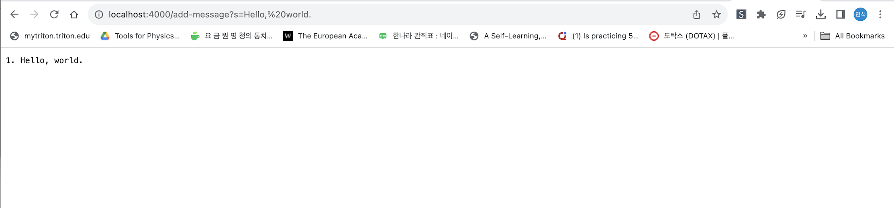
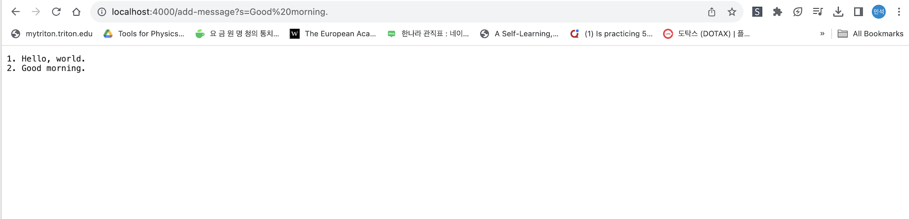
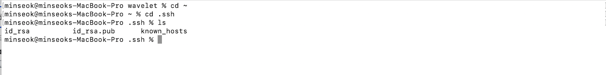
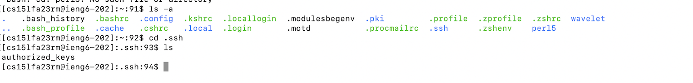
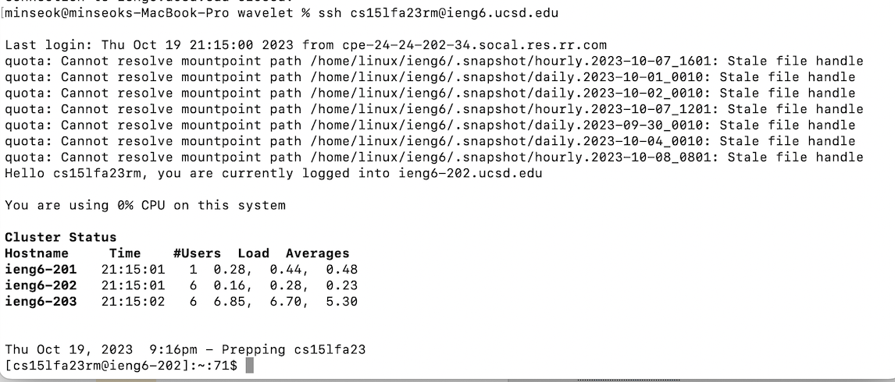

# Part1

## StringServer.java

```

// A simple web server using Java's built-in HttpServer

// Examples from https://dzone.com/articles/simple-http-server-in-java were useful references

import java.io.IOException;
import java.io.OutputStream;
import java.net.InetSocketAddress;
import java.net.URI;

import com.sun.net.httpserver.HttpExchange;
import com.sun.net.httpserver.HttpHandler;
import com.sun.net.httpserver.HttpServer;

import java.net.URI;
import java.net.URL;

class Handler implements URLHandler{

    String display ="";
    static int index = 1;
    public String handleRequest(URI url){
        if(url.getPath().endsWith("/add-message")){
            if(url.getQuery()==null) return display;
            String[] parameters = url.getQuery().split("=");
            if(parameters.length<=1||parameters[0].equals("s") return display;
            String s = parameters[1];
            String s_index = String.valueOf(index);
            display+=s_index+". "+s+"\n";
            index +=1;
        }
        return display;
}   
}

public class StringServer{
    public static void main(String[] args) throws IOException {
        if(args.length == 0){
            System.out.println("Missing port number! Try any number between 1024 to 49151");
            return;
        }

        int port = Integer.parseInt(args[0]);

        Server.start(port, new Handler());
    }
    
}

interface URLHandler {
    String handleRequest(URI url);
}

class ServerHttpHandler implements HttpHandler {
    URLHandler handler;
    ServerHttpHandler(URLHandler handler) {
      this.handler = handler;
    }
    public void handle(final HttpExchange exchange) throws IOException {
        // form return body after being handled by program
        try {
            String ret = handler.handleRequest(exchange.getRequestURI());
            // form the return string and write it on the browser
            exchange.sendResponseHeaders(200, ret.getBytes().length);
            OutputStream os = exchange.getResponseBody();
            os.write(ret.getBytes());
            os.close();
        } catch(Exception e) {
            String response = e.toString();
            exchange.sendResponseHeaders(500, response.getBytes().length);
            OutputStream os = exchange.getResponseBody();
            os.write(response.getBytes());
            os.close();
        }
    }
}

class Server {
    public static void start(int port, URLHandler handler) throws IOException {
        HttpServer server = HttpServer.create(new InetSocketAddress(port), 0);

        //create request entrypoint
        server.createContext("/", new ServerHttpHandler(handler));

        //start the server
        server.start();
        System.out.println("Server Started! Visit http://localhost:" + port + " to visit.");
    }
}

```
### First attempt with add-message 

&nbsp;


### Second attempt with add-message


1. I used handleRequest method from lab2 which I duly changed it.
2. Relevant argument: URI url
- First Attempt : "localhost:4000/add-message?s=Hello, world."
- Second Attempt : "localhost:4000/add-message?s=Good Morning"

   Fields:
- String display -> this variable stores all strings to display on the webpage
- int index -> this number counts how many times domain is ended with /add-message
- String[] parameters ->this array stores contents of query by splitting it around "="
- String s -> this string stores content to be add
- String s_index -> stores value of index into string

   
  First attempt:
- String display = "" -> "1. Hello, world."
- int index = 1, String[] parameters = {"s", "Hello, world."}
- String s = "Hello, world", String s_index = "1"
  
   Second attempt:
- String display = "1. Hello world." -> "1. Hello world." +"\n"+ 2. Good morning"
- int index = 2,     String[] parameters = {"s", "Good morning."}
- String s = "Good morning" ,     String s_index = "2"
  

    

# Part2
### Path to private key

id_rsa is my private key.
&nbsp;

### Path to public key


&nbsp;

### Login without typing password


# Part3

Before writing this report I didn't know how to use java URLHandler class and also was not easy with ssh and other commands.
Also, I was not good at uploading and organizing my directories and files both in my computer and github repositories. As time goes, I feel more confident about doing things.
