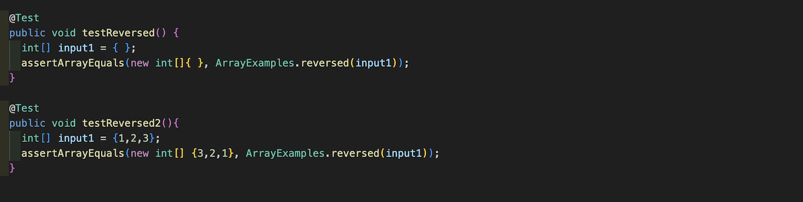
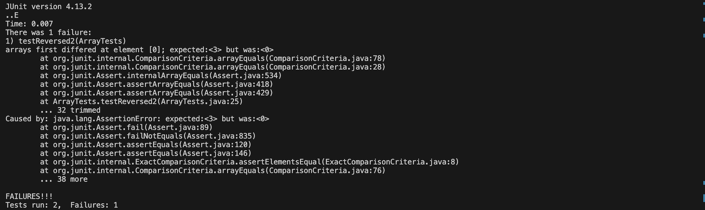
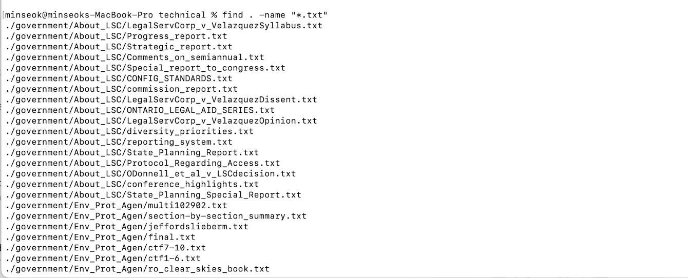
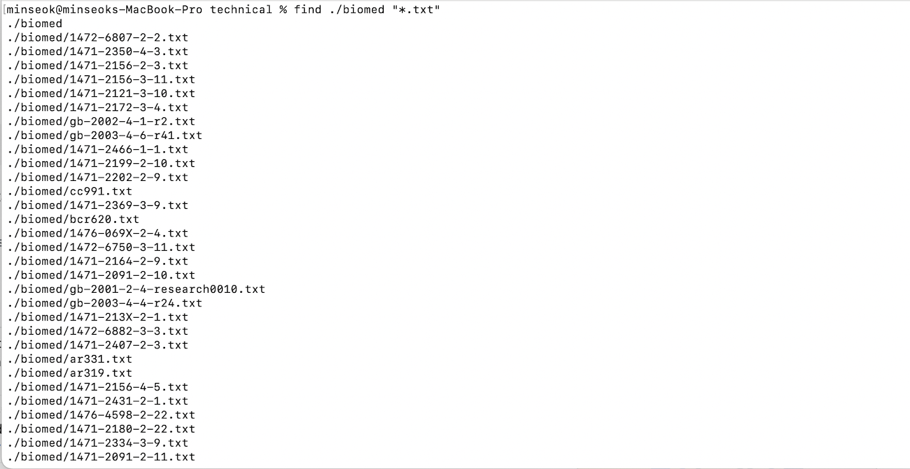
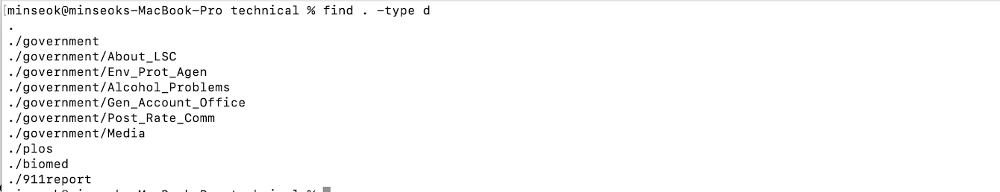
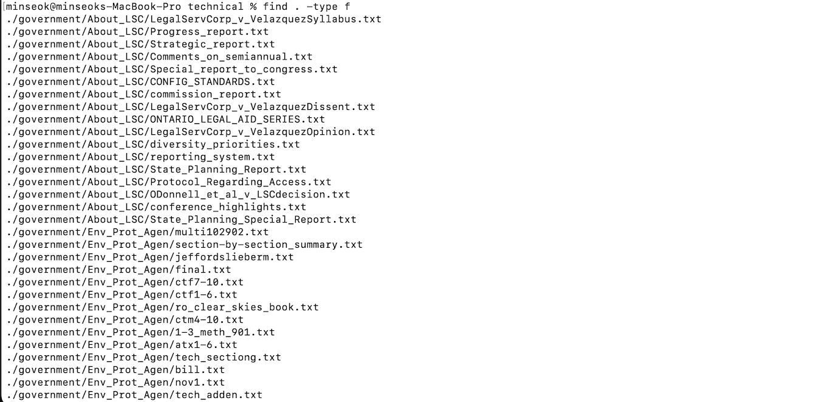
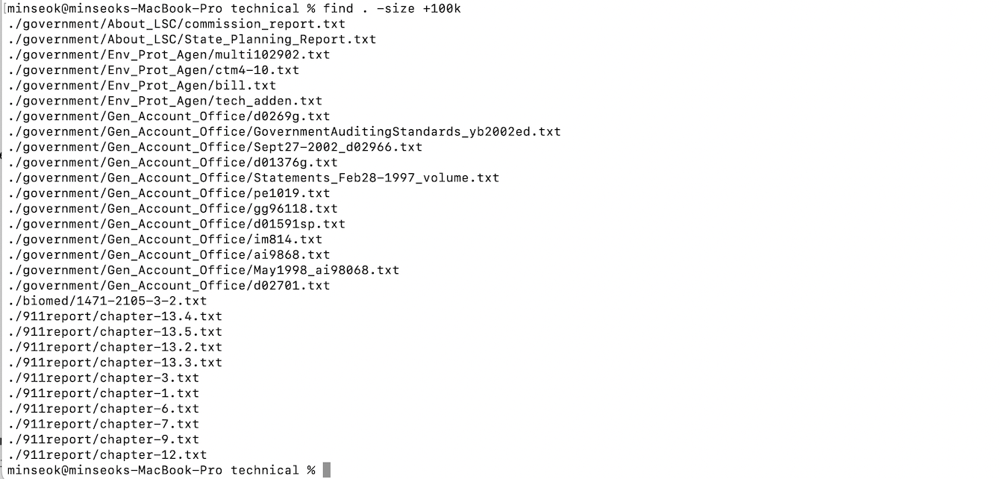
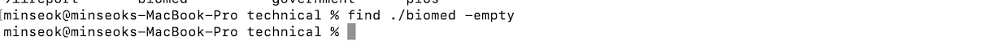
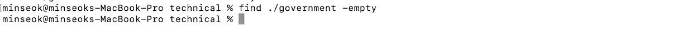

# Part 1 - Bugs
## ArrayExamples.reversed method has bug in its code 


1. Failure input
```
  @Test
  public void testReversed2(){
    int[] input1 = {1,2,3};
    assertArrayEquals(new int[] {3,2,1}, ArrayExamples.reversed(input1));
  }
```
2. Passing input
```
  @Test
  public void testReversed() {
    int[] input1 = { };
    assertArrayEquals(new int[]{ }, ArrayExamples.reversed(input1));
  }
```
3. Symptom
   Test Code
   
   &nbsp;&nbsp;&nbsp;&nbsp;&nbsp;
   
   Results
   
   
5. Bug and the Fix
- Bug
```
  static int[] reversed(int[] arr) {
    int[] newArray = new int[arr.length];
    for(int i = 0; i < arr.length; i += 1) {
      arr[i] = newArray[arr.length - i - 1];
    }
    return arr;
  }
```

  - Fix
    
```
    static int[] reversed(int[] arr) {
    int[] newArray = new int[arr.length];
    for(int i = 0; i < arr.length; i += 1) {
      newArray[i] = arr[arr.length - i - 1];
    }
    return newArray;
  }
```
In original code, newArray is initiated with all 0. Respectively, as we  all loop over the arr all elements in arr become 0.
For the fix, we copy from arr to newArray in reverse and return newArray.


# Part 2 - Researching Commands
## I choosed find command

1. -name flag: find files based on their name
   &nbsp;&nbsp;
   

   &nbsp;&nbsp;
   - Find all text files under current all subdirectories.

   &nbsp;&nbsp;
   - Find all text files under biomed directory.
    &nbsp; &nbsp;


   
2. -type flag: find files based on their type
   &nbsp;&nbsp;
   

   &nbsp;&nbsp;
  - Find all subdirectories. We can easily see file-structure in this way


   &nbsp;&nbsp;
  - Find all files under current and sub directories. We can easily search for files we want if the number of files are small.
    &nbsp; &nbsp; 

  
3. -size flag: search for files based on size we can use comparison operator such as +,-,=.&nbsp;
   &nbsp;&nbsp;
   

  &nbsp; &nbsp; 
  - Find all files under current and sub directories with size less than 512byte. We can see files under certain size.
   &nbsp; &nbsp;


  &nbsp;&nbsp;
  - Find all files under current and sub directories with size more than 100k. In this way, we can see which files need lots of memories.
 &nbsp; &nbsp; 

4. -empty flag: search for empty files
   &nbsp;&nbsp;
   

   &nbsp;&nbsp;
  - Find empty files in biomed directory. We can search for blank text files and maybe delete it.
    &nbsp; &nbsp; &nbsp; &nbsp;&nbsp;


   &nbsp;&nbsp;
  - Find empty files in government directory. We can search for blank text files and maybe delete it.
  &nbsp; &nbsp; 

