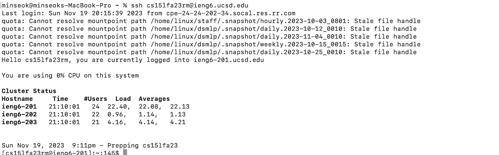
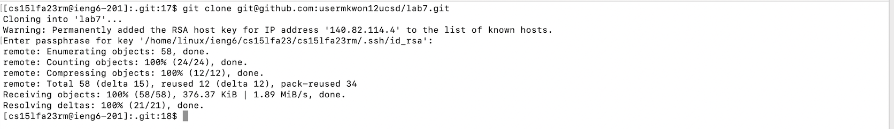
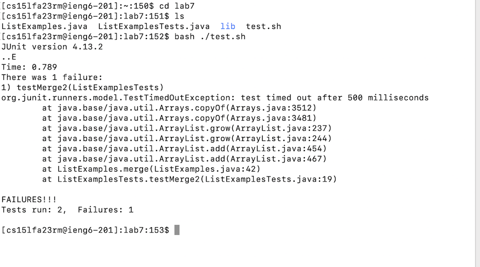
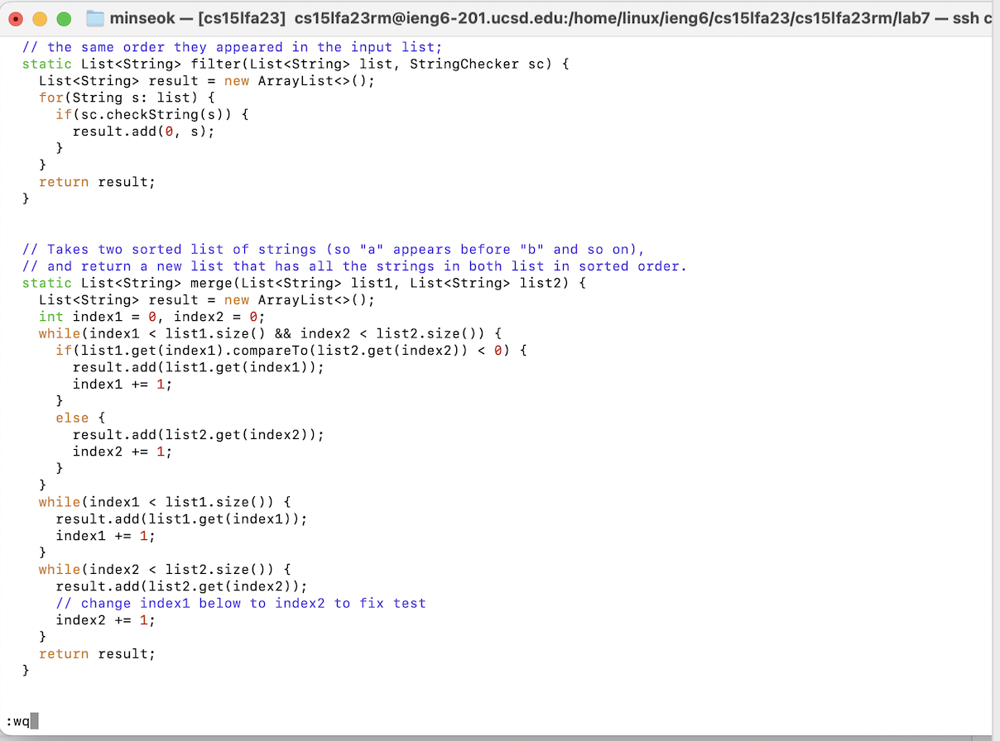
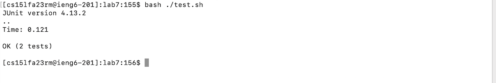
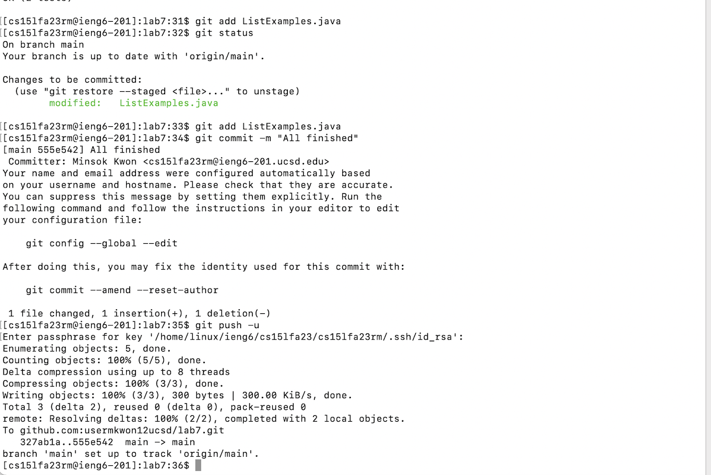

## Step4:

- Key pressed:`ssh cs15lfa23rm@ucsd.edu<enter>`
## Step5:

- Key pressed:  `git clone git@github.com:usermkwon12ucsd/lab7.git <enter>`. Then entered my passphrase for the key.
## Step6

- Key pressed:I pressed cd lab7 `<enter>` go to subdirectory. Then ls`<enter>` to check I have all the files. After that, I pressed bash ./test.sh`<enter>` to run the test.
## Step7

- Key pressed:I pressed `vim ListExamples.java<enter>` to open a file. Then pressed `<down>` 44 times and `<right>` 11 times to go to the character that I want.
  After that I pressed `xi2<esc>:wq<enter>`.
## Step8

-Key pressed:I pressed `bash ./test.sh<enter>` to run the test.
## Step9

-Key pressed: `git add ListExamples.java<enter>` to add ListExamles files to git index folder. Then commit with messages `git commit -m "All finished"<enter>`. After that `git push -u<enter>` to push all the previous changes. Finally I entered my passphrases.
