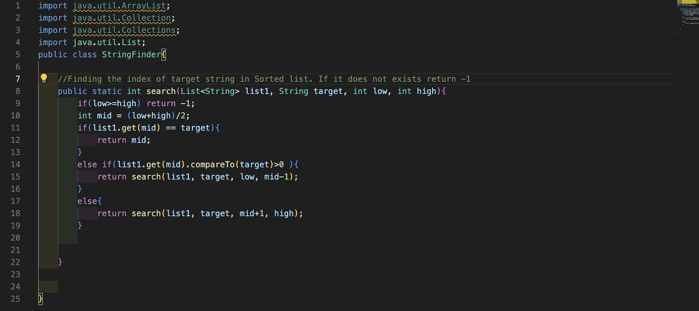
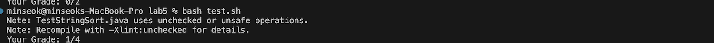
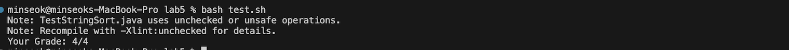

# Part1
## Step1
My code:

Test result:

I can't find which part of my code is wrong!! I don't think there is any edge case that I don't cover.
## Step2
There are edge cases.
You should think about more edge cases.
First, think what would happen if List length is very small namely 0 or 1.
Second, what would happen if some of inputs are null?
For safety, when you compare two strings you should not use == operators.

## Step3

Thanks, I didn't think about the case where target == null and list1 == null. I guess that's where my code fails the tests.
Also, I now use String.equals method to check if two strings are equal. Now I know == operator does not work for some cases in string comparison.
## Step4
- File Structure:\
lab5\
-StringSort.java\
-TestStringSort.java\
-test.sh

P.S I am running all comands from lab5 directory.
- Before fixing the bug
java files:

```
import java.util.ArrayList;
import java.util.Collection;
import java.util.Collections;
import java.util.List;
public class StringFinder{

    //Finding the index of target string in Sorted list. If it does not exists return -1
    public static int search(List<String> list1, String target, int low, int high){
        if(low>=high) return -1;
        int mid = (low+high)/2;
        if(list1.get(mid) == target){
            return mid;
        }
        else if(list1.get(mid).compareTo(target)>0 ){
            return search(list1, target, low, mid-1);
        }
        else{
            return search(list1, target, mid+1, high);
        }
        
    
    }

    
}
```

bash files:

```
#bash file to auto grade student's submission
CPATH='.:lib/hamcrest-core-1.3.jar:lib/junit-4.13.2.jar'
RUNPATH='java -cp .:lib/hamcrest-core-1.3.jar:lib/junit-4.13.2.jar org.junit.runner.JUnitCore' 
javac -cp $CPATH *.java
java -cp $RUNPATH TestStringSort > testresult.txt


pass=$(tail -n 2 testresult.txt | grep -c "OK")

    failures=$(tail -n 2 testresult.txt | head -n 1 | grep -o '[0-9]*$')
    total=$(tail -n 2 testresult.txt | grep -oE '[0-9]+' | sed -n 1p)
    echo "Your Grade: $((total - failures))/$((total))"
```

JUnit testing files:

```
import static org.junit.Assert.*;
import org.junit.*;
import java.util.*;

public class TestStringSort{

    @Test 
    public void test(){
        List str1= Arrays.asList(new String[] {"a", "b", "c"});
        StringFinder s = new StringFinder();
        assertEquals(1, s.search(str1, "b", 0, str1.size()-1));
    }
   

    @Test
    public void test2(){
        List str1= Arrays.asList(new String[] {"a", "b", "c"});
        StringFinder s = new StringFinder();
        assertEquals(-1, s.search(str1, null, 0, str1.size()-1));

    }
    @Test
    public void test3(){
        List str1= Arrays.asList(new String[] {"a", "b", "c","e","h","k"});
        StringFinder s = new StringFinder();
        assertEquals(2, s.search(str1, "c", 0, str1.size()-1));

    }
    @Test
    public void test4(){
        List str1= Arrays.asList(new String[] {"a"});
        StringFinder s = new StringFinder();
        assertEquals(0, s.search(str1, "a", 0, str1.size()-1));
    }
}
```

- command that I ran:bash test.sh
- I fixed bugs modifying this line
`if(low>=high) return -1; ` to
`if(low>high || target == null || list1 == null|| low<0 || high>list1.size()) return -1;`
It checks the edge cases where taget and list are null.
Moreover, I now use String.equals method to check if two strings are equal.


# Part2
The most helpful conecepts that I learned from this classes are those about bash command.\
Even though I have used macbook for a long time, I was not used to run various linux commands.\
All that I knew was only basic things such as  cd, touch and mkdir.\
Moreover writing bash file to run file or debug or even mimic autograding was even more helpful.
